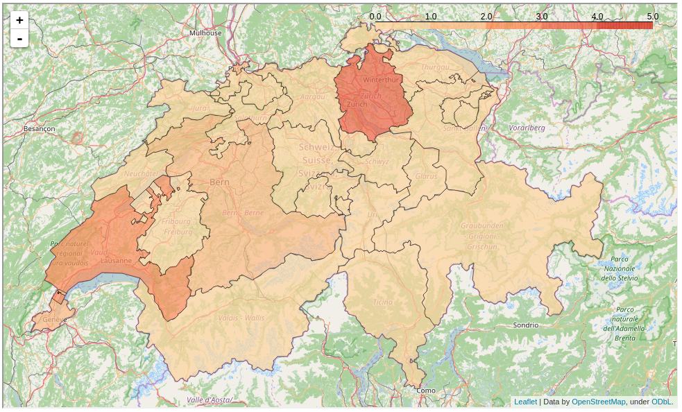

# 03 - Interactive Viz

## Final interactive map

## Deadline
Friday October 28, 2016 at 11:59PM

## Important Notes
* Make sure you push on GitHub your Notebook with all the cells already evaluated
* Don't forget to add a textual description of your thought process, the assumptions you made, and the solution
you plan to implement!
* Please write all your comments in English, and use meaningful variable names in your code

## Background
In this homework we will practice with interactive visualization, which is the key ingredient of many successful viz (especially when it comes to infographics).
You will be working with the P3 database of the [SNSF](http://www.snf.ch/en/Pages/default.aspx) (Swiss National Science Foundation).
As you can see from their [entry page](http://p3.snf.ch/), P3 already offers some ready-made viz, but we want to build a more advanced one for the sake
of quick data exploration. Therefore, start by [downloading the raw data](http://p3.snf.ch/Pages/DataAndDocumentation.aspx) (just for the Grant Export), and read carefully
the documentation to understand the schema. Install then [Folium](https://github.com/python-visualization/folium) to deal with geographical data (*HINT*: it is not
available in your standard Anaconda environment, therefore search on the Web how to install it easily!) The README file of Folium comes with very clear examples, and links 
to their own iPython Notebooks -- make good use of this information. For your own convenience, in this same directory you can already find a TopoJSON file with the 
geo-coordinates of each Swiss canton (which can be used as an overlay on the Folium maps).

## Assignment
1. Build a [Choropleth map](https://en.wikipedia.org/wiki/Choropleth_map) which shows intuitively (i.e., use colors wisely) how much grant money goes to each Swiss canton.
To do so, you will need to use the provided TopoJSON file, combined with the Choropleth map example you can find in the Folium README file.

*HINT*: the P3 database is formed by entries which assign a grant (and its approved amount) to a University name. Therefore you will need a smart strategy to go from University
to Canton name. The [Geonames Full Text Search API in JSON](http://www.geonames.org/export/web-services.html) can help you with this -- try to use it as much as possible
to build the canton mappings that you need. For those universities for which you cannot find a mapping via the API, you are then allowed to build it manually -- feel free to stop 
by the time you mapped the top-95% of the universities. I also recommend you to use an intermediate viz step for debugging purposes, showing all the universties as markers in your map (e.g., if you don't select the right results from the Geonames API, some of your markers might be placed on nearby countries...)

2. *BONUS*: using the map you have just built, and the geographical information contained in it, could you give a *rough estimate* of the difference in research funding
between the areas divided by the [Röstigraben](https://en.wikipedia.org/wiki/R%C3%B6stigraben)?

*HINT*: for those cantons cut through by the Röstigraben, [this viz](http://p3.snf.ch/Default.aspx?id=allcharts) can be helpful!
